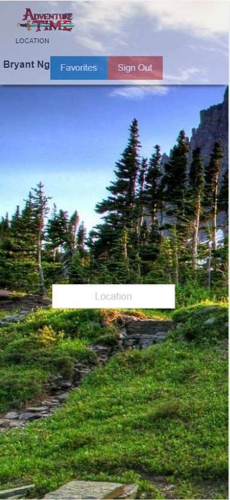
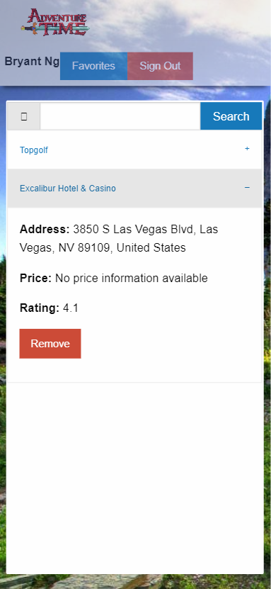

# Adventure Time
Manage your travel budget and plan things to do with Adventure Time. Travelers with a limited budget use this application to put every dollar to work in planning the best vacation for their budget. Utilizing different APIs, plan what hotel, entertainment and what the weather is at and be ready for the adventure that waits.

## How it works

1. Create an account by logging in with Google.
2. Once you've created an account log in where if successful you will be directed to te homepage.
3. Homepage gives you a text input to enter any location in the world
4. Next page will let you enter how expensive you want your expenses to be. 1 being cheapest and 4 being expensive.
5. Following page will let you search between different categories you would look up when traveling
6. After choosing one, you can save it and it will be saved to your account for future reference.

## Live Deployed

https://bnguyen78.github.io/adventure-time/

====

## Technologies Used

* React - A javascript library for building user interfaces
* MongoDb - document oriented NoSQL database used used for high volume data storage.
* Express - web application framekwork
* Mongoose - MongoDb library to manage relationships between data
* Passport - authentication middleware for Node.js
* JSON Web Token - used to securely transmit informaiton between parties as a JSON object.
* Axios - promise based HTTP client for the browser 
* Material UI - React UI framework

* Google API - API that utilizes Google search functions
* Google Authentication - authentication middleware provided by Google
* Dark Skies API - API that lets users search up current and past weather histories
* Firebase - mobile and web application development platform

## Contributors 
* Bryant Nguyen https://github.com/bnguyen78
* Maverick Schirmer https://github.com/schirmerm
* Nathaniel Hauser https://github.com/mesmerizingYeti
* Rayford Riney https://github.com/RayRiney
